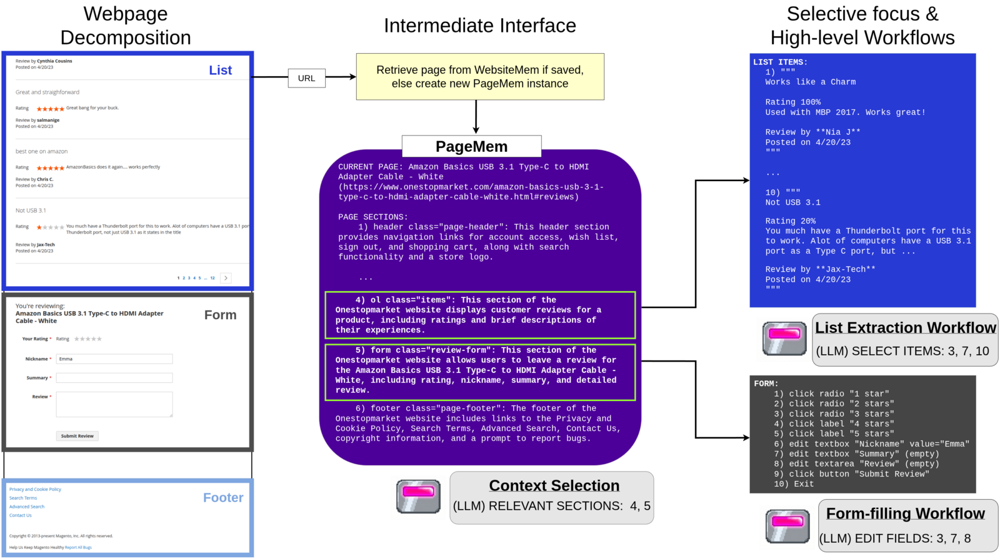
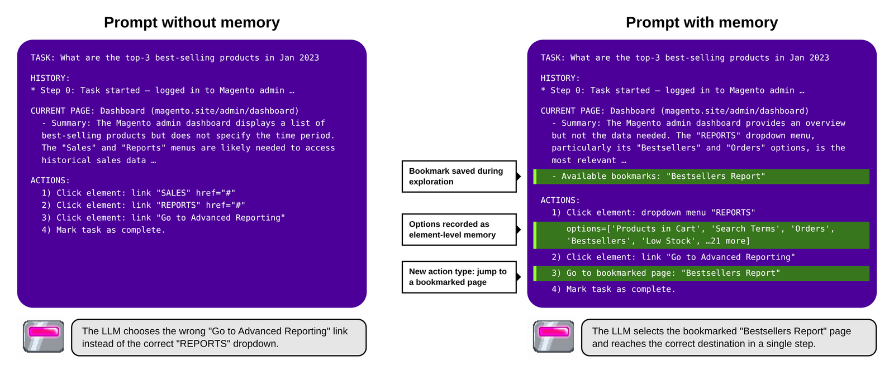
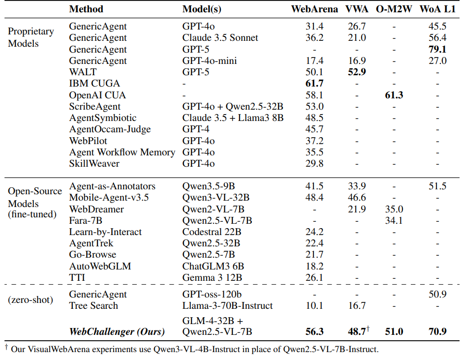
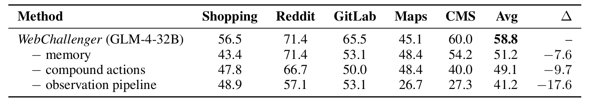
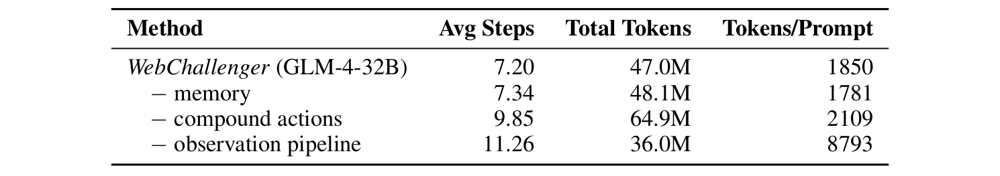
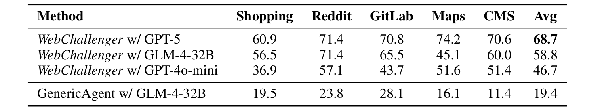

**TLDR**: We created a web agent harness that lets the LLM choose its own context, memorize site layout through exploration, and execute multi-step workflows for common actions like form filling.\
\> Results in open-source SOTA across mutliple benchmarks.\
\> Harness design alone can more than double performance!

[Paper](https://arxiv.org/abs/2606.10423) [Code](https://github.com/jayoohwang1/webchallenger) [Website](https://jayoohwang1.github.io/webchallenger-site/)

<video controls muted playsinline width="100%" src="/videos/main_figure_anim.mp4"></video>

## Why is computer use hard for LLMs?

I was drawn to this problem because I found it weird that LLMs seemed to struggle so much more with tasks like controlling a web browser than humans do. It's weird because doing basic stuff like clicking, typing, and scrolling doesn't feel hard at all.

Even small open-source models seem like they understand websites well enough that they should be able to handle these tasks. Modern LLMs have more knowledge about the web than any person. Our advantages must instead come from other factors, like better efficiency and coherence over long time horizons.

A great [blog post](https://yusu.substack.com/p/computer-use-modern-moravecs-paradox?open=false#%C2%A7why-is-computer-use-hard-for-ai) by Yu Su described this as a modern Moravec's paradox: the things AI finds hardest tend to be the things evolution spent the longest making effortless for us.

This made me curious about what subconscious operations my brain was performing to allow me to browse so much more efficiently than LLM agents. I started taking note of the seemingly trivial automatic things my mind, eyes, and hands were actually doing.

The most relevant differences I noticed were:
- **Humans are lazy readers.** When I'm on a webpage I skim almost everything and only focus on small parts of it that I think are useful. I also remember the layout of pages I have seen before, which means that I read pages more efficiently the more familiar they are. On Twitter for example, I basically never look at the left sidebar unless something changes. An LLM agent has no choice but to read it every turn.
- **Humans remember websites.** When humans use a website a few times, we naturally build up a mental map of it. What's where, what the buttons do, which page leads to which. The only options LLM agents have for memory are training (slow and expensive) and context (requires a harness to enable read/write/storage).
- **Humans perform routines.** Once a person has used a search bar a few times, the whole process runs on autopilot as one smooth sequence (e.g., click, type, wait for suggestions, pick one or hit enter). An LLM agent has to stop and re-read the full page between every micro-step, even when only a small predictable page change occurred.

These are all capabilities that current language model architectures can't perform on their own without external tools. Training better models helps make up for these limitations, but a limited harness can still bottleneck performance. We wanted to see how much web agent performance could be improved by scaffolding these functionalities around existing models.

## WebChallenger

WebChallenger is a harness that structures the interaction between the LLM and the web environment to give the agent selective attention, memory, and high-level actions. It does this by converting webpages into a unified representation called PageMem, which is what lets all three components work across sites without any site-specific code.

### Observation: the agent picks which parts of the page to read

Our system first needs to convert a given webpage into a format the agent can work with efficiently. To give a webpage to an LLM, normally the choices are to either pass the whole page (general but inefficient) or to parse out specific content (efficient but reliant on page structure).

Splitting the page into sections allows us to provide our agent with precise selection while also maintaining generality. We recursively split the DOM and stop when a section is either below a size threshold or hits a natural boundary (e.g., header, footer, form, table, list).

A page split into sections like this is what we call a PageMem. Each section comes with a one-sentence summary along with the set of interactive elements inside it. Sections with lots of similar children (lists and tables) are treated as a special list section type. The summaries get cached and reused on later visits which is where the PageMem name comes from.

*Figure 1: (left) A product review page decomposed into sections. (middle) Sections are summarized into a PageMem. (right) The agent can focus on relevant sections and dispatch specialized workflows for lists and forms.*

Once the current page is in the form of a PageMem, the observation pipeline runs as follows:
1. The LLM first looks at the list of section summaries and picks which ones look relevant to the task.
2. For each selected section, we prompt the LLM again to extract just the task-relevant details from that section's full content.
    - List sections can be very large, so we chunk them and have the LLM select relevant items from each chunk before extracting details from just the selected items.
3. Finally, all the extracted details get synthesized into a one-paragraph page summary which acts as the agent's observation for the current step.

This works because most webpages have a low signal-to-noise ratio and are highly compressible from the agent's perspective. In practice, the pipeline lets us handle pages with over 100k tokens of content while keeping the largest single LLM prompt around 10k tokens.

### Exploration: a one-time walk gives the agent persistent site memory

Humans can explore a new website and quickly memorize its basic layout. We give our agent a similar ability through a one-time exploration phase before any task begins.

**Procedure.** Starting from the homepage, exploration clicks the unique interactive elements on each page and records what happens. If the click navigates to a new page, that page gets added to the exploration frontier. If the click just expands part of the current page (like a dropdown menu opening), the revealed elements get recorded as belonging to the clicked element. The process continues depth-first until we hit a configured cap on depth, pages, or time.

**Efficiency.** The process is fully deterministic and runs without any LLM guidance, task demonstrations, or external documentation. PageMem's structure also helps avoid redundant exploration. When a page contains a list of similar items, we only explore elements contained in one item. We also skip exploring pages that have the same structure as one that was previously explored (e.g., different product pages on the same site).

**Memory output.** Exploration results in a per-site WebsiteMem: a collection of PageMems with summaries as well as element-level memories like dropdown options. When the agent later revisits an explored page during a task, it loads the cached PageMem and only sections that have changed get re-summarized. At task start the agent can also select bookmarks from the explored page set to use as navigation shortcuts.

By the time the agent starts its first task, it already has a map of the site and knows what most of the buttons do.

*Figure 2: The agent's decision prompt for the same task step without (left) and with (right) site memory. Highlighted in green is the content contributed by WebsiteMem: a bookmark collected during exploration, dropdown options recorded as element-level memories, and a bookmark navigation action. With memory, the agent jumps straight to the Bestsellers report instead of detouring through Advanced Reporting.*

### Action: collapse common micro-interactions into workflows

Many web interactions only cause partial changes to the current page (e.g., a dropdown opening, form field being filled). Human vision naturally focuses on change and ignores static parts of the environment, but transformer-based LLMs have no choice but to spend compute on every token. We use workflows to bundle sequences of micro-interactions occurring on the same page into single compound actions. This avoids reprocessing mostly unchanged pages and keeps the agent's decisions anchored at meaningful transitions.

PageMem makes this practical because it gives us a structured snapshot of page state that we can diff. When the dropdown workflow clicks an element and the menu expands, we diff the page to get the new options and re-prompt the LLM to pick one. Form filling works similarly: the LLM selects fields, enters values one at a time, and reviews the result before submitting. Each sub-step gets a focused prompt with only the relevant state change.

A side benefit of our structured page representation is that it lets us drop tool-calling entirely as the action interface. We instead provide a numbered list of candidate actions pulled from the selected sections and the LLM just picks an index. The harness then automatically maps the selection to the right function based on element type. This is simpler for small models to handle reliably and saves prompt space by omitting tool-use schemas.

## Results

We tested on a wide variety of benchmarks to see how our harness affects web agent performance across many different sites and task types. For all experiments we use off-the-shelf opensource models without any training (GLM-4-32B planner with Qwen2.5-VL-7B or Qwen3-VL-4B for VisualWebArena).

*Table 1: Main benchmark results.*

[WebArena](https://arxiv.org/abs/2307.13854) is a reproducible environment that simulates common site categories (shopping, forum, wiki, maps, GitLab, CMS). WebChallenger surpasses the performance of agents that train on synthetic WebArena environment data. It also achieves comparable performance to approaches that scaffold API models. Just applying more scaffolding to a small general-purpose model can beat fine-tuning and larger models at a much lower cost.

[VisualWebArena](https://arxiv.org/abs/2401.13649) builds on WebArena but focuses on tasks that require visual reasoning. We again get strong performance even though we use a text-only LLM planner with Qwen3-VL-4B as an image captioning model. Normally this forces a tradeoff regarding how detailed the image captions are. Observation decomposition and focused extraction allows us to both use detailed image captions and keep context concise at the same time.

[Online-Mind2Web](https://arxiv.org/abs/2504.01382) consists of tasks on 136 live real-world websites which lets us explore how robust our system is across sites with different implementations. WebChallenger gets 51.0% success rate coming 10 points shy of [OpenAI CUA](https://openai.com/index/introducing-operator/). Even though our harness is fairly intricate, it makes minimal assumptions about website structure which helps it generalize.

Our harness performed especially well on the [WorkArena](https://arxiv.org/abs/2403.07718) benchmark, which involves interacting with complex enterprise interfaces (e.g., navigating a dropdown menu with over 100 nested options). Our compound action workflows ended up being really effective at keeping the LLM on track across these kinds of structured multi-step interactions. We hit a 70.9% success rate, which surpasses the best open-model results by 20% and comes close to the SOTA 79.1% from GPT-5.

For all our experiments we didn't use any finetuning or benchmark specific prompts. These results excite me because they indicate that our harness mainly improves performance by addressing common bottlenecks that LLM agents face while trying to control a web browser.

## Analysis

We ran ablations on each of the three components of WebChallenger and compared its performance with different models. We also compared how our LLM performs using a minimalist harness. All analysis experiments were done on the 165 task WebArena-lite subset.

### Ablations

*Table 2: Success rate on WebArena-lite with each component of WebChallenger removed.*

*Table 3: Step count, token usage, and prompt size impact of each component.*

The observation pipeline had the greatest impact on performance, resulting in a 17.6% SR difference when removed. Page splitting results in increased total token usage but lower average prompt size. Decomposing large prompts into multiple smaller prompts has a huge performance benefit.

Memory contributes the least amount to average performance at 7.6% because it benefits three of the environments but has little effect on Maps and Reddit. Our LLM seemed to have enough knowledge to navigate those two sites even without memory.

Compound actions improve performance by 9.7% and brings major efficiency benefits since the LLM doesn't have to re-process minor page changes between substeps.

### WebChallenger performs well with both strong and weak models

Replacing GLM-4-32B with GPT-5 scales performance from 58.8% to 68.8%.

We also tried using WebChallenger with GPT-4o-mini and it managed to score 46.7%, which is way beyond the 17.4% 4o-mini scored on the full benchmark with a standard harness.

*Table 4: Performance on WebArena-lite with different backbone LLMs and with a simple harness.*

### vs. standard harness

To isolate how much performance comes from our harness alone, we test the same GLM-4-32B model with the GenericAgent harness from [BrowserGym](https://arxiv.org/abs/2412.05467). With this minimal scaffolding setup, GLM-4-32B scores only 19.4%, meaning that our harness nearly tripled its performance.

## Related work

### Exploration and memory
Agents that explore web environments are commonly used to generate synthetic training data ([BAGEL](https://arxiv.org/abs/2403.08140), [NNetscape](https://arxiv.org/abs/2410.02907), [Go-Browse](https://arxiv.org/abs/2506.03533), [Explorer](https://arxiv.org/abs/2502.11357), [PAE](https://arxiv.org/abs/2412.13194), [Agents-as-Annotators](https://arxiv.org/abs/2604.07776), [SynthAgent](https://arxiv.org/abs/2511.06101), [AutoSurfer](https://arxiv.org/abs/2604.27253), [SAGE](https://openreview.net/forum?id=9twwDW60Bw)).

Other works that have investigated alternative ways to provide web agents with external memory include [AWM](https://arxiv.org/abs/2409.07429), [ReasoningBank](https://arxiv.org/abs/2509.25140), [ICAL](https://arxiv.org/abs/2406.14596), [Assimilation and Accommodation](https://aclanthology.org/2025.findings-acl.720/), [WebCoach](https://arxiv.org/abs/2511.12997), [JEF-Hinter](https://arxiv.org/abs/2510.04373), [WebATLAS](https://arxiv.org/abs/2510.22732), [Learn-by-Interact](https://arxiv.org/abs/2501.10893), [AutoGuide](https://arxiv.org/abs/2403.08978), [AutoManual](https://arxiv.org/abs/2405.16247). A notable difference is that these works focus on goal-centric memories (e.g., to do 'X', click 'Y' then...), while our memory is environment-centric (these are the bookmarked pages on this website, this dropdown menu has these options, cached summaries of visited pages).

Another major difference is that most previous works use LLM-guided exploration while our exploration algorithm is deterministic, reminiscent of web crawling. During exploration models are only used to generate summaries describing the semantic content of the pages. This lets us perform a much broader, cheaper exploration of a site that saves more 'low-level' information about every page, which is a complementary direction previous agents haven't focused as much on.

### High-level actions
Works such as [SkillWeaver](https://arxiv.org/abs/2504.07079), [WebXSkill](https://arxiv.org/abs/2604.13318), [WALT](https://arxiv.org/abs/2510.01524), [Recon-Act](https://arxiv.org/abs/2509.21072), [ASI](https://arxiv.org/abs/2504.06821), [PolySkill](https://arxiv.org/abs/2510.15863), and [ActionEngine](https://arxiv.org/abs/2602.20502) also explore providing web agents with higher level action spaces. These usually have an LLM create programmatic scripts for websites, which are then added to the agent's tools.

Probably the most significant difference in our approach is our unified PageMem representation which allows us to use the same workflow implementations across websites. This is more suitable for small models since the LLM doesn't need to write code by reasoning over the page HTML.

### Observation decomposition
There have been several vision-based computer use agents that share a similar theme of page decomposition by allowing the model to zoom in on specific page regions ([ViGoRL](https://arxiv.org/abs/2505.23678), [TRISHUL](https://arxiv.org/abs/2502.08226), [RegionFocus](https://arxiv.org/abs/2505.00684), [R-VLM](https://arxiv.org/abs/2507.05673)).

[WebFurl](https://github.com/WeaveMindAI/Webfurl) is the only other web agent I know of that also does DOM-based decomposition. Their implementation differs by doing multiple levels of nesting while we use two levels (summary and full content). Their agent also differs in how it interacts with the compressed page by using an "unfold" action while we do extraction + summarization.

Outside of web agents, other works like [RLM](https://arxiv.org/abs/2512.24601), [MemWalker](https://arxiv.org/abs/2310.05029), [PRISM](https://arxiv.org/abs/2412.18914), and [ReadAgent](https://arxiv.org/abs/2402.09727) have also improved LLM performance by decomposing large contexts into smaller subcalls.

## Limitations and future directions

The main limitation of our approach is that it uses many more LLM calls per step compared to most other web agents, which multiplies latency and inference cost. This makes it work really well with small models that get a large relative performance increase but makes it less suitable for larger models. Our implementation also uses fixed heuristics derived from common website patterns that might be suboptimal for sites with highly unusual structure.

We also went for a deliberately minimal memory implementation in this work for simplicity and efficiency, so it would be interesting to have the agent record other kinds of memories (like remembering user preferences across sites). Some more interesting future directions include training models jointly with the harness, trying to integrate web browsing with coding agents in a seamless manner, and allowing the agent to modify its own harness.

## Thoughts on agent harnesses

Harness design feels like it has enormous leverage right now because LLMs are clearly capable of much more than what their default interface allows. On its own, a model can only take in a token sequence, read all of it, then return a token sequence. It needs an intermediate software layer to do everything else required to function autonomously, like deciding what enters the context window and when, storing data, and converting output tokens into actions. Some domains like coding are a better natural fit for LLMs and therefore need less scaffolding, but domains that don't fit as well are going to benefit more from adaptation through the harness.

Web browsing is awkward for LLMs because it involves long sequences of sparse observations with frequent partial state changes, while transformers benefit from focused prompts at meaningful decision points. Similar factors seem to apply in other highly interactive environments like video games ([Claude and Gemini playing Pokemon](https://www.lesswrong.com/posts/8aPyKyRrMAQatFSnG/untitled-draft-x7cc), [ARC-AGI-3](https://arcprize.org/leaderboard/community)) where harness design also appears to have an outsized effect.

Larger, more capable models can help make up for these difficulties, but a well-designed harness can potentially turn a hard task into a task that's easy even for smaller models. Having a frontier reasoning model chew through tokens to do something menial like read a webpage and click a button, all just to overcome an interface mismatch, feels like a waste. This is why I'm bullish on multi-agent setups like dynamic workflows in claude code where expensive models can systematically coordinate efficient ones to perform tedious work.

Overall, I think the design space of agent harnesses is still very underexplored, especially when it comes to harnesses that scale the number of LLM calls using smaller models like WebChallenger. Going forward, as the field continues pushing agents towards longer and more open-ended tasks, the surface area for improvement through scaffolding will inevitably keep growing.

\
\
*Thanks to collaborators Sean (Xiaowen) Zhang and Vedant Padwal, as well as the ML Collective community for their feedback.*

